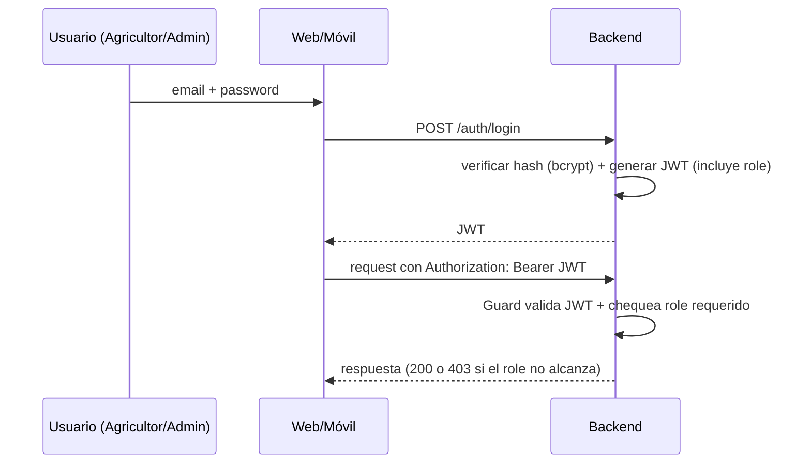
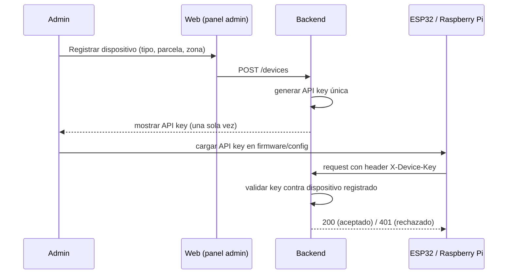
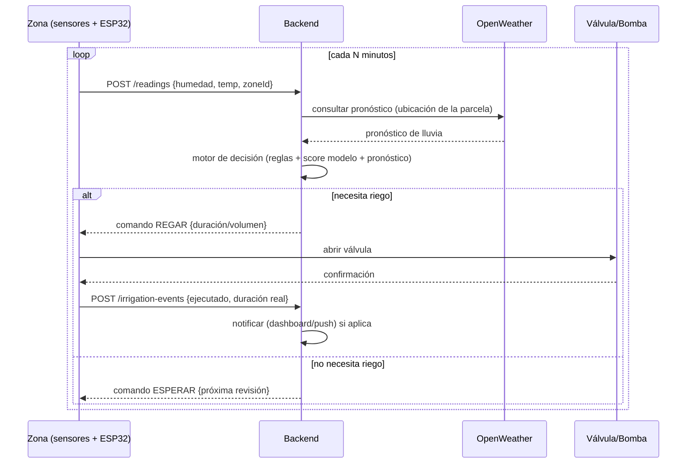
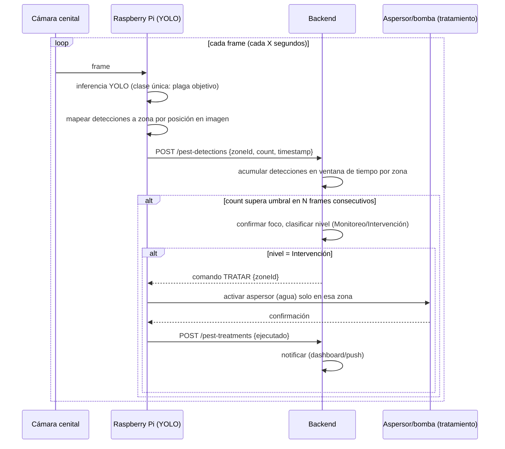
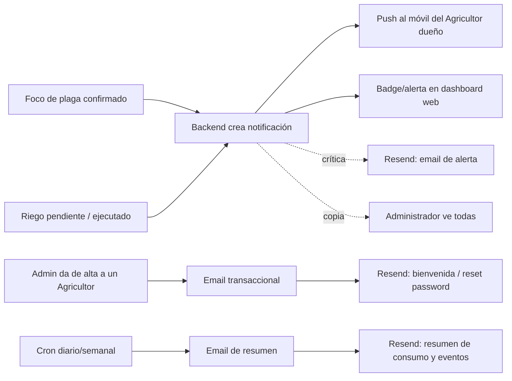
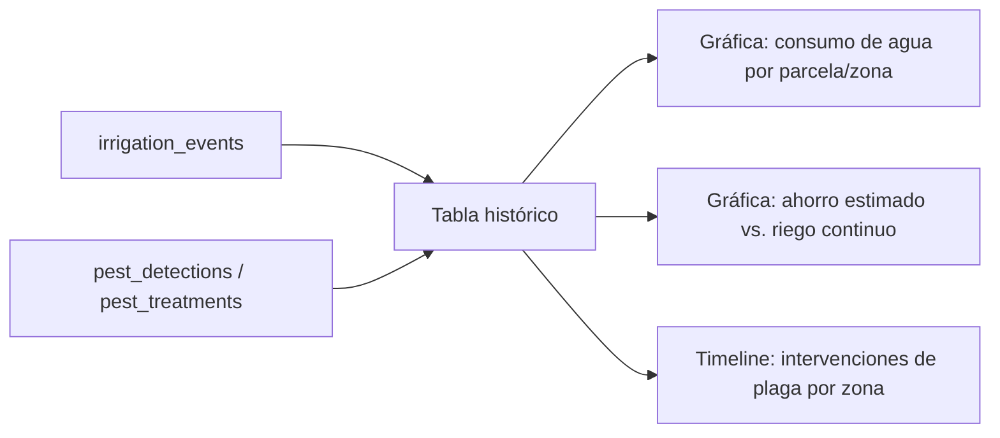

# Flujos por módulo — SmartRiego MX (borrador para corregir)

Basado en `constitution.md`. Esto es previo a la spec formal de cada módulo — sirve para acordar el flujo antes de escribir RF en EARS. Corregir aquí antes de pasar a [[Spec 001]] por módulo.

## 1. Autenticación y roles

**A corregir:** ¿el Administrador da de alta a los Agricultores (no hay auto-registro), o cualquiera se puede registrar como Agricultor?

## 2. Registro de dispositivos IoT (ESP32 / Raspberry Pi)

**A corregir:** ¿la key se puede regenerar/revocar desde el panel? ¿un dispositivo puede moverse de zona sin volver a registrarse?

## 3. Riego inteligente (ciclo por zona)

**A corregir:** ¿el ESP32 pide permiso antes de regar (como en el diagrama) o el backend empuja el comando de forma proactiva (requeriría algo tipo polling corto o WebSocket, no solo REST)? Esto define si es *pull* (ESP32 pregunta "¿qué hago?") o *push* (backend avisa). Con HTTP REST simple, lo natural es *pull*: el ESP32 manda su lectura y en la misma respuesta recibe el comando.

## 4. Detección de plagas (ciclo por zona)

**A corregir:** ¿cuántos frames consecutivos / qué ventana de tiempo define "confirmado"? ¿el tratamiento tiene un cooldown (no repetir cada pocos segundos sobre la misma zona)?

## 5. Notificaciones (push + dashboard + email vía Resend)

Tres usos de Resend, a definir en la spec del módulo:
1. **Alertas críticas** (foco de plaga, fallo de dispositivo) — email como respaldo del push, no lo reemplaza.
2. **Transaccionales de cuenta** — bienvenida cuando el Administrador da de alta a un Agricultor, reset de password.
3. **Resumen periódico** — reporte de consumo/eventos por email.

**A corregir:**
- ¿El Administrador recibe push de todo, o solo ve un resumen al entrar al dashboard?
- ¿Cada cuánto va el resumen periódico (diario/semanal) y quién lo recibe (solo Agricultor de esa parcela, o también Admin)?
- ¿Toda alerta crítica manda email, o solo si no hubo confirmación de lectura del push en X minutos?

## 6. Histórico y reportes

**A corregir:** ¿"ahorro estimado" se calcula contra qué línea base (riego fijo diario, por ejemplo)? Falta definir la fórmula si se quiere mostrar ese número en el pitch.

---

Ver [[Home]] · [[Constitucion]] · [[Recursos/Concepto — Riego y plagas]]
