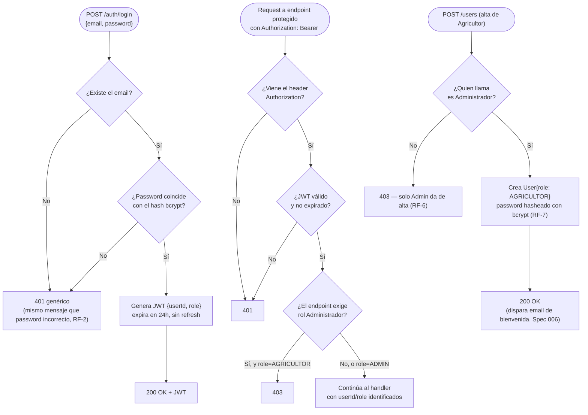

# Spec 001 — Autenticación y roles

## Contexto y objetivo
Todo el sistema necesita saber quién hace cada request (Agricultor u Administrador) para aplicar la matriz de `docs/permissions.md`. Sin esto no se puede construir ningún otro módulo protegido.

## Usuarios / actores
Agricultor, Administrador.

## Historias de usuario
- H1: Como Agricultor quiero iniciar sesión con email/password para ver únicamente mis parcelas.
- H2: Como Administrador quiero iniciar sesión con email/password para gestionar toda la plataforma.
- H3: Como Administrador quiero dar de alta agricultores para que puedan usar el sistema.

## Requisitos funcionales (EARS)
- RF-1: CUANDO un usuario envía email+password correctos a `POST /auth/login`, EL SISTEMA responde con un JWT que incluye `userId` y `role`.
- RF-2: SI el email o password son incorrectos, ENTONCES EL SISTEMA responde 401 sin indicar cuál de los dos falló.
- RF-3: MIENTRAS una request incluya un JWT válido, EL SISTEMA identifica al usuario y su rol en cada endpoint protegido.
- RF-4: SI una request a un endpoint protegido no incluye JWT o el JWT es inválido/expirado, ENTONCES EL SISTEMA responde 401.
- RF-5: SI un endpoint exige rol Administrador y el JWT es de un Agricultor, ENTONCES EL SISTEMA responde 403.
- RF-6: EL SISTEMA solo permite que un Administrador cree cuentas de Agricultor (`POST /users`) — no existe auto-registro público.
- RF-7: EL SISTEMA almacena el password con hash bcrypt; nunca en texto plano ni en logs.

## Requisitos no funcionales
- El JWT expira a las 24 horas, sin refresh token — el usuario vuelve a loguearse al expirar.

## Casos límite
- Login con email inexistente → mismo mensaje genérico que password incorrecto (RF-2).
- Doble login del mismo usuario en dos dispositivos → ambos tokens válidos hasta expirar (no hay invalidación de sesión única en v1).

## Fuera de alcance
- OAuth externo (Google, etc.). Recuperación de password por email queda en Spec 006 (Notificaciones), no aquí.

## Criterios de finalización
- RF-1 a RF-7 con test en verde (unitario + integración con Postgres real) + demo manual: login de un Agricultor y de un Administrador, cada uno viendo solo lo que le corresponde.

## Diagrama — todos los casos de login y autorización

## Dudas abiertas
- Ninguna bloqueante.
