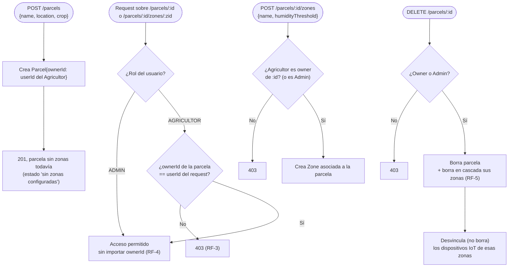

# Spec 002 — Gestión de parcelas y zonas

## Contexto y objetivo
Cada Agricultor necesita registrar sus parcelas y dividirlas en zonas independientes — es la base de datos sobre la que operan riego y plagas (constitution.md #5).

## Usuarios / actores
Agricultor (CRUD de las suyas), Administrador (lectura/edición de cualquiera).

## Historias de usuario
- H1: Como Agricultor quiero crear una parcela con su cultivo y ubicación para empezar a monitorearla.
- H2: Como Agricultor quiero dividir mi parcela en zonas con su propio umbral de humedad para regar distinto por zona.
- H3: Como Administrador quiero ver las parcelas de cualquier Agricultor para dar soporte o configurar el sistema.

## Requisitos funcionales (EARS)
- RF-1: CUANDO un Agricultor crea una parcela (`POST /parcels` con nombre, ubicación, cultivo), EL SISTEMA la asocia a su `ownerId`.
- RF-2: CUANDO un Agricultor agrega una zona a su parcela (`POST /parcels/:id/zones` con nombre y umbral de humedad objetivo), EL SISTEMA la crea asociada a esa parcela.
- RF-3: EL SISTEMA impide que un Agricultor lea, edite o borre una parcela/zona cuyo `ownerId` no sea el suyo (403).
- RF-4: EL SISTEMA permite a un Administrador leer y editar cualquier parcela/zona sin importar el `ownerId`.
- RF-5: CUANDO se borra una parcela, EL SISTEMA borra en cascada sus zonas y desvincula (no borra) los dispositivos IoT asignados a ellas.

## Requisitos no funcionales
- N/A específicos más allá de los generales de la constitución.

## Casos límite
- Parcela sin zonas todavía → estado "sin zonas configuradas" en vez de error.
- Intento de crear zona en una parcela ajena → 403 (RF-3).

## Fuera de alcance
- Geolocalización real en mapa (coordenadas se guardan como texto/dirección, no se valida contra un mapa).

## Criterios de finalización
- RF-1 a RF-5 con test en verde + demo manual: un Agricultor crea una parcela con 2 zonas, un segundo Agricultor no puede verla, el Administrador sí.

## Diagrama — todos los casos de acceso y CRUD

## Dudas abiertas
- Ninguna bloqueante.
