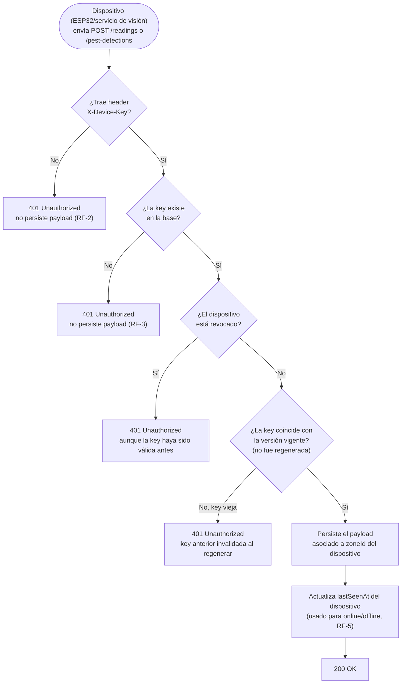
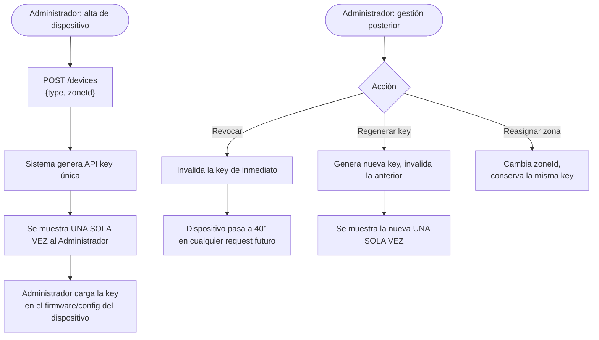

# Spec 003 — Registro y autenticación de dispositivos IoT

## Contexto y objetivo
El ESP32 (riego) y el servicio de visión (plagas) necesitan mandar datos al backend de forma segura y quedar asignados a una zona específica (constitution.md #10).

## Usuarios / actores
Administrador (da de alta/revoca dispositivos), ESP32/servicio de visión (consumen la API con su key).

## Historias de usuario
- H1: Como Administrador quiero registrar un dispositivo y asignarlo a una zona para que sus lecturas se apliquen ahí.
- H2: Como Administrador quiero revocar la key de un dispositivo comprometido o dado de baja.

## Requisitos funcionales (EARS)
- RF-1: CUANDO un Administrador registra un dispositivo (`POST /devices` con tipo `ESP32`/`VISION_SERVICE` y `zoneId`), EL SISTEMA genera una API key única y la muestra una sola vez.
- RF-2: EL SISTEMA exige el header `X-Device-Key` en todo endpoint de ingestión (`/readings`, `/pest-detections`) y lo valida contra un dispositivo activo.
- RF-3: SI la API key no corresponde a ningún dispositivo activo, ENTONCES EL SISTEMA responde 401 y no persiste el payload.
- RF-4: CUANDO un Administrador revoca un dispositivo (`DELETE /devices/:id` o `POST /devices/:id/revoke`), EL SISTEMA invalida su key inmediatamente.
- RF-5: EL SISTEMA muestra en el panel de Administrador el estado de cada dispositivo: online (lectura en los últimos 5 minutos) u offline (sin lectura en más de 5 minutos).

## Requisitos no funcionales
- La API key no se puede volver a mostrar tras su creación (solo regenerar, invalidando la anterior).

## Casos límite
- Dispositivo reasignado a otra zona → conserva su key, cambia solo `zoneId`.
- Dos dispositivos del mismo tipo en la misma zona → permitido (ej. sensor de humedad + actuador separados).
- Dispositivo revocado que sigue mandando requests → siempre 401, aunque la key haya sido válida antes.
- Regenerar key de un dispositivo activo → la key anterior deja de funcionar de inmediato, aunque el dispositivo no haya sido revocado.

## Fuera de alcance
- Aprovisionamiento automático (zero-touch); el alta siempre la hace un Administrador manualmente.

## Criterios de finalización
- RF-1 a RF-5 con test en verde + demo manual: registrar un dispositivo, mandar una lectura con su key, revocarlo y confirmar que la siguiente lectura es rechazada.

## Diagrama — todos los casos de ingestión con API key

## Dudas abiertas
- Ninguna bloqueante.
