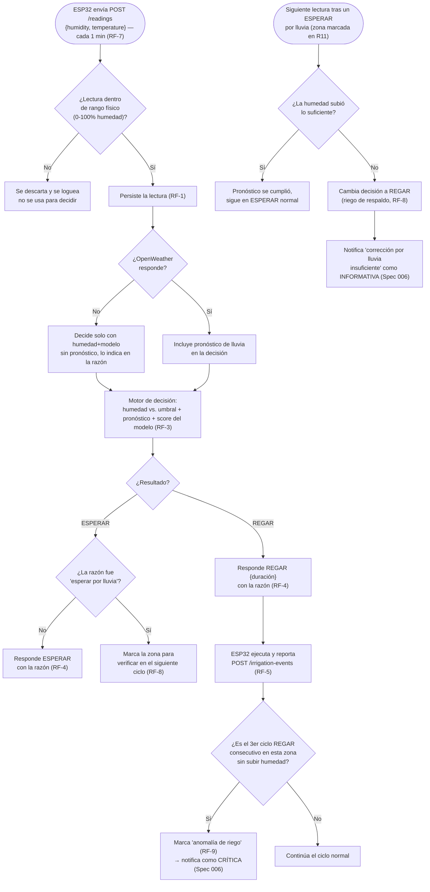

# Spec 004 — Riego inteligente por zona

## Contexto y objetivo
El corazón del producto: decidir cuándo/cuánto regar cada zona y ejecutar la acción, no solo recomendarla (constitution.md #6, diferenciador vs IRRIMODEL en `Recursos/Diferenciación vs IrriModel` del vault).

## Usuarios / actores
Agricultor/Administrador (consultan estado), ESP32 (reporta lecturas y ejecuta comandos).

## Historias de usuario
- H1: Como Agricultor quiero que cada zona se riegue automáticamente solo cuando lo necesita, sin intervención manual.
- H2: Como Agricultor quiero ver por qué el sistema decidió regar o no regar una zona.

## Requisitos funcionales (EARS)
- RF-1: CUANDO el ESP32 de una zona envía una lectura (`POST /readings` con humedad, temperatura), EL SISTEMA la persiste asociada a esa zona y su timestamp.
- RF-2: CUANDO se recibe una lectura, EL SISTEMA consulta el pronóstico de lluvia (OpenWeather) para la ubicación de la parcela.
- RF-3: EL SISTEMA calcula una recomendación de riego combinando: humedad actual vs. umbral de la zona, pronóstico de lluvia, y el score de un modelo entrenado con dataset (constitution.md #6).
- RF-4: EL SISTEMA responde a la request de lectura (RF-1) con un comando `REGAR {duración}` o `ESPERAR {próxima revisión}`, y la razón de la decisión (humedad, pronóstico, score).
- RF-5: CUANDO el ESP32 reporta que ejecutó un riego (`POST /irrigation-events`), EL SISTEMA registra el evento (zona, duración real, humedad antes/después de la siguiente lectura).
- RF-6: EL SISTEMA nunca aplica una decisión de riego a más de una zona por el estado de otra — cada zona se evalúa de forma independiente.
- RF-7: EL SISTEMA reevalúa la decisión de cada zona **cada 1 minuto**, en cada lectura del ESP32.
- RF-8: SI una decisión fue `ESPERAR` por pronóstico de lluvia (RF-4), ENTONCES EL SISTEMA compara, en la lectura del siguiente ciclo, el incremento real de humedad contra el esperado; si no subió lo suficiente, EL SISTEMA cambia la decisión a `REGAR` (riego de respaldo) y lo marca como "corrección por lluvia insuficiente" para Spec 006 (Notificaciones).
- RF-9: SI una zona recibe 3 ciclos de riego consecutivos (RF-4 = `REGAR`) sin que la humedad suba respecto a la lectura anterior, ENTONCES EL SISTEMA marca la zona como "anomalía de riego" y lo notifica según Spec 006 (posible falla física: válvula, sensor, suministro).

## Requisitos no funcionales
- Ciclo de lectura/decisión: cada 1 minuto (RF-7).
- Consumo de agua se mide en **tiempo regado (minutos)**, no en litros — evita depender de un caudal físico conocido.
- Mock de clima solo en tests automatizados (constitution.md #13).

## Casos límite
- Falla la consulta a OpenWeather → el sistema decide solo con humedad+modelo, sin pronóstico, y lo indica en la razón mostrada.
- Lectura de humedad fuera de rango físico (ej. negativa o >100%) → se descarta y se loguea, no se usa para decidir.

## Fuera de alcance
- **Riego manual/override por el Agricultor**: el sistema es 100% automático en v1, no existe botón de "regar ahora".
- Cálculo de volumen exacto de agua en litros (se mide en minutos regados, ver Requisitos no funcionales).

## Criterios de finalización
- RF-1 a RF-9 con test en verde (motor de decisión con distintos escenarios humedad/pronóstico, incluyendo el caso de corrección por lluvia insuficiente y el de anomalía) + demo física: una zona con humedad baja riega, otra con humedad normal no.

## Diagrama — ciclo completo de decisión (todos los casos)

## Dudas abiertas
- Ninguna bloqueante.
