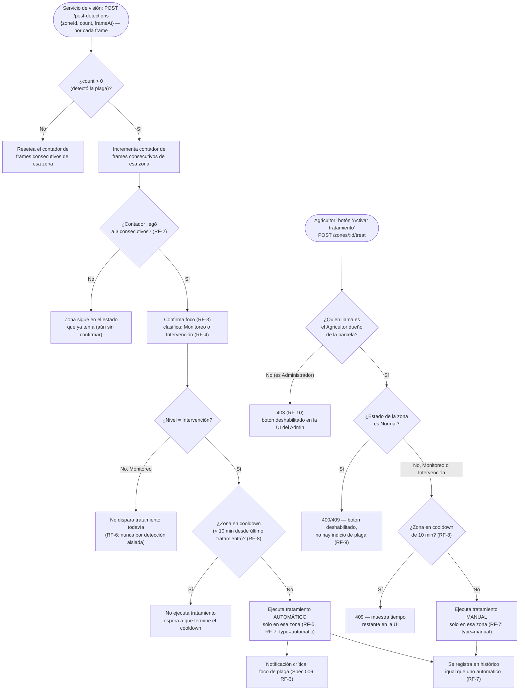

# Spec 005 — Detección de plagas por visión artificial

## Contexto y objetivo
Segundo pilar del producto: detectar un foco de una plaga objetivo por zona y tratarlo de forma localizada, sin actuar por falsos positivos (constitution.md #7, #8, #9).

## Usuarios / actores
Agricultor (consulta estado, puede activar tratamiento manual en su zona), Administrador (solo consulta estado, no puede activar tratamiento), servicio de visión (microservicio Python que corre YOLO y reporta detecciones, ejecuta tratamiento).

## Historias de usuario
- H1: Como Agricultor quiero que el sistema detecte una plaga en mi cultivo sin que yo tenga que revisar la cámara constantemente.
- H2: Como Agricultor quiero que el tratamiento se aplique solo donde está el problema, no en toda la parcela.
- H3: Como Agricultor quiero poder activar el tratamiento manualmente en una zona si ya veo que hay indicios de plaga, sin esperar a que el sistema lo confirme solo.

## Requisitos funcionales (EARS)
- RF-1: CUANDO el servicio de visión procesa un frame con YOLO y detecta la plaga objetivo, EL SISTEMA recibe (`POST /pest-detections`) la zona, el conteo de detecciones y el timestamp.
- RF-2: EL SISTEMA acumula detecciones por zona y exige **3 frames consecutivos** con detección de la plaga objetivo en la misma zona antes de confirmar un foco.
- RF-3: SI el conteo de detecciones se sostiene durante 3 frames consecutivos (RF-2), ENTONCES EL SISTEMA confirma un "foco de plaga" en esa zona.
- RF-4: EL SISTEMA clasifica cada zona en `Normal` / `Monitoreo` / `Intervención` según su conteo confirmado (constitution.md #8).
- RF-5: CUANDO una zona pasa a `Intervención`, EL SISTEMA envía un comando de tratamiento a esa zona únicamente (constitution.md #9).
- RF-6: EL SISTEMA nunca ejecuta tratamiento automático por una sola detección aislada (RF-3 es condición obligatoria previa a RF-5).
- RF-7: EL SISTEMA registra cada tratamiento ejecutado (`POST /pest-treatments`) con zona, timestamp, y si fue automático o manual (RF-9).
- RF-8: EL SISTEMA no repite un tratamiento en la misma zona antes de un cooldown de **10 minutos**, sin importar si el anterior fue automático o manual.
- RF-9: EL SISTEMA permite al **Agricultor dueño de la parcela** activar el tratamiento manualmente (`POST /zones/:id/treat`) **solo cuando la zona está en estado `Monitoreo` o `Intervención`** (no en `Normal`) y solo si no está en cooldown (RF-8).
- RF-10: EL SISTEMA rechaza (403) cualquier intento del **Administrador** de activar el tratamiento manual — el botón/endpoint es exclusivo del Agricultor dueño de esa parcela, el Administrador solo puede consultar el estado.

## Requisitos no funcionales
- El modelo YOLO reconoce una sola clase (la plaga objetivo elegida) — constitution.md #7.

## Casos límite
- Cámara sin conexión / sin frames nuevos → la zona no cambia de estado por falta de datos (no se asume "Normal" por ausencia de lecturas).
- Detección en el borde entre dos zonas de la imagen → la imagen se divide en un **grid de cuadrantes fijos** que coincide con las zonas físicas de la maqueta; cada detección se asigna al cuadrante donde cae su centroide, sin calibración manual.
- Agricultor intenta activar tratamiento manual con la zona en `Normal` → 400/409, botón deshabilitado en la UI (RF-9).
- Agricultor intenta activar tratamiento manual dentro del cooldown de 10 min → 409, se muestra el tiempo restante en la UI.

## Fuera de alcance
- Reconocimiento de más de una especie (constitution.md #17). Aplicación real de pesticida (constitution.md #9 — siempre simulado con agua, tanto automático como manual). Dron físico real (constitution.md #17). Activación manual por el Administrador (RF-10).

## Criterios de finalización
- RF-1 a RF-10 con test en verde (lógica de confirmación temporal con distintas secuencias de frames, y el guard de rol+estado+cooldown del tratamiento manual) + demo física: provocar detecciones sostenidas en una zona y ver el tratamiento activarse solo ahí; además, activar manualmente el tratamiento como Agricultor y confirmar que el mismo intento como Administrador es rechazado.

## Diagrama — detección automática + activación manual (todos los casos)

## Dudas abiertas
- Ninguna bloqueante.
