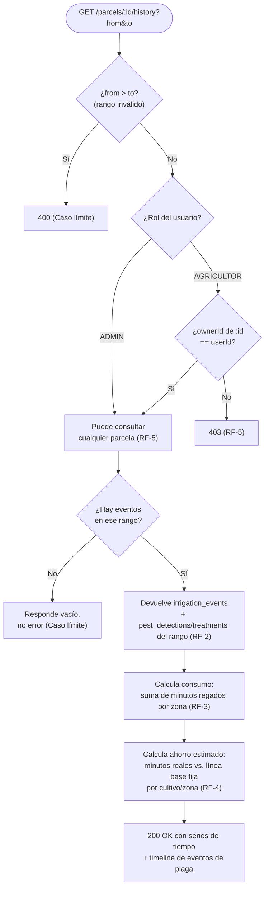

# Spec 007 — Histórico y reportes

## Contexto y objetivo
Persistir todo evento de riego y plaga para poder graficar consumo, ahorro e intervenciones — clave también para el pitch del hackathon (constitution.md #12).

## Usuarios / actores
Agricultor (ve el histórico de sus parcelas), Administrador (ve el de todas).

## Historias de usuario
- H1: Como Agricultor quiero ver cuánta agua he ahorrado usando SmartRiego MX vs. un riego tradicional.
- H2: Como Agricultor quiero ver un timeline de cuándo hubo focos de plaga y qué se hizo.

## Requisitos funcionales (EARS)
- RF-1: EL SISTEMA persiste cada `irrigation-event` y `pest-detection`/`pest-treatment` con su zona, parcela y timestamp (ya cubierto por Spec 004/005 — este módulo solo los consulta/agrega).
- RF-2: CUANDO se solicita el histórico de una parcela (`GET /parcels/:id/history` con rango de fechas), EL SISTEMA devuelve los eventos de riego y plaga de ese rango.
- RF-3: EL SISTEMA calcula el consumo de agua por zona/parcela sumando la **duración en minutos** de los riegos ejecutados (no se convierte a litros, ver Spec 004).
- RF-4: EL SISTEMA calcula un "ahorro estimado" comparando los minutos reales regados contra un **tiempo de riego fijo de referencia** por zona/cultivo (línea base de riego tradicional), expresado como porcentaje o minutos ahorrados.
- RF-5: EL SISTEMA impide que un Agricultor consulte el histórico de una parcela que no es suya (403, mismo criterio que Spec 002 RF-3); el Administrador puede consultar cualquiera.

## Requisitos no funcionales
- Las consultas de histórico deben paginar o acotar por rango de fechas — no se devuelve todo el histórico completo sin filtro.

## Casos límite
- Parcela sin eventos todavía → responde vacío, no error.
- Rango de fechas inválido (fin antes que inicio) → 400.

## Fuera de alcance
- Exportar reportes a PDF/Excel (solo visualización en dashboard en v1).

## Criterios de finalización
- RF-1 a RF-5 con test en verde + demo manual: mostrar la gráfica de consumo de una parcela con datos reales generados durante la demo.

## Diagrama — todos los casos de consulta de histórico

## Dudas abiertas
- [NECESITA ACLARACIÓN] Valor exacto del "tiempo de riego fijo de referencia" por cultivo/zona (línea base) — depende del cultivo elegido para la demo, se define al configurar la parcela de prueba.
